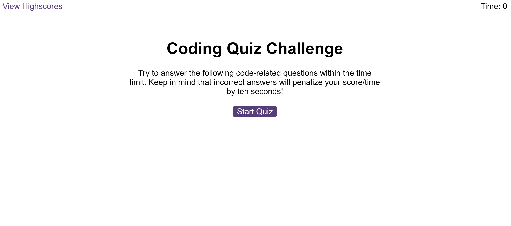
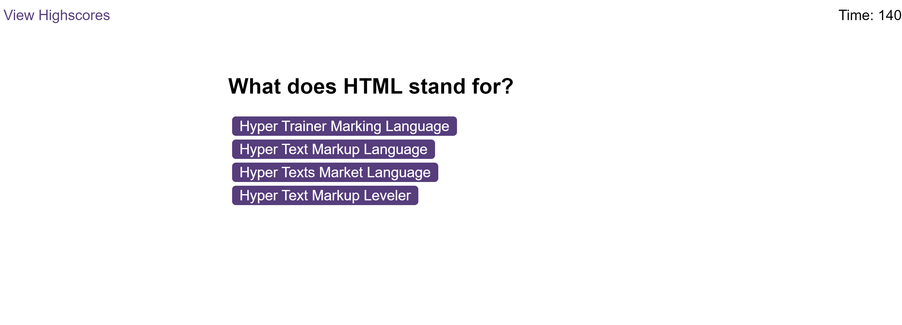
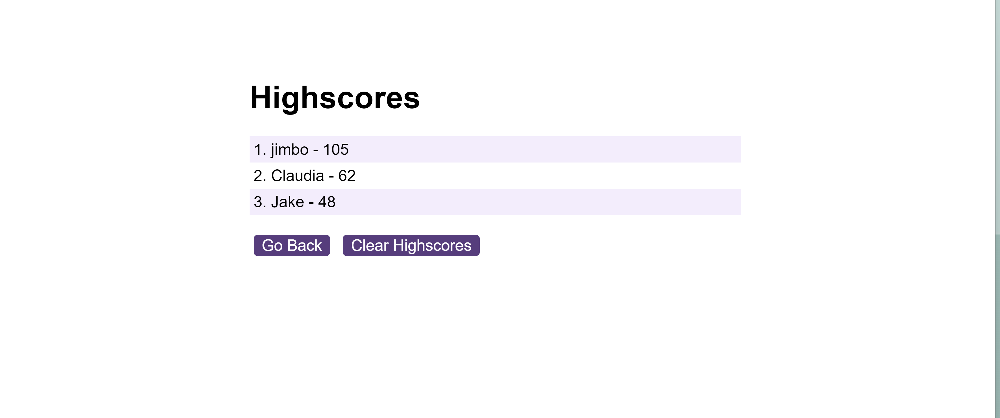

# Coding Quiz Challenge

## Description

The Coding Quiz Challenge is an interactive web application designed to test users' knowledge of programming concepts through a series of multiple-choice questions. This timed quiz not only evaluates the user's understanding but also adds a competitive edge by saving high scores, allowing participants to gauge their progress against peers. The application features a sleek, user-friendly interface with dynamic updates to HTML and CSS via JavaScript.

## Screenshot

*Above is a preview of the Coding Quiz Challenge in action.*

## Description

This project is a web-based application that serves as a coding quiz with multiple-choice questions. It is designed to test knowledge on various programming topics. Users can take a timed quiz on JavaScript fundamentals, with their high scores saved and able to be viewed later.

The quiz is dynamic, with HTML and CSS powered by JavaScript. It features a clean, polished, and responsive user interface.

## Installation

To install the project, follow these steps:

1. Clone the repo to your local machine using `git clone https://github.com/your-username/your-repo-name.git`
2. Open the folder in your preferred code editor.
3. Launch `index.html` in a web browser to start using the application.

## Usage

To use the coding quiz:

1. Open `index.html` in your web browser.
2. Click the "Start Quiz" button to begin.
3. Answer the questions as they are presented within the time limit.
   - Incorrect answers will penalize your score/time by reducing the timer.
4. After completing the quiz, your score is displayed, and you can save your initials.

Navigate to `highscores.html` to view the high scores.

## Features

- Start screen with a brief explanation and a "Start Quiz" button.
- Timed multiple-choice questions.
- Feedback provided for correct or incorrect answers.
- Score calculation based on the time remaining.
- High score saving and viewing functionality.

## Deployed Application

You can access the live application at the following URL: [Coding Quiz Challenge Live](https://your-deployment-link.com)
